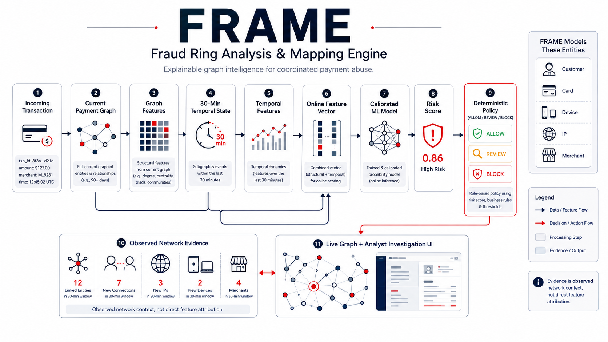

<div align="center">

# FRAME

### Fraud Ring Analysis & Mapping Engine

**Explainable graph intelligence for coordinated payment abuse.**

<br />

[](https://www.python.org/)
[](https://fastapi.tiangolo.com/)
[](https://react.dev/)
[](https://www.typescriptlang.org/)
[](https://networkx.org/)
[](https://scikit-learn.org/)
[](https://github.com/ThunderKhan/frame/actions/workflows/ci.yml)
[](LICENSE)

<br />

**Graph-based fraud detection · Temporal risk analysis · Analyst investigation workflow**

</div>

---

<p align="center">
  <a href="#the-problem">Problem</a> •
  <a href="#architecture">Architecture</a> •
  <a href="#synthetic-benchmark">Benchmark</a> •
  <a href="#live-demo">Demo</a> •
  <a href="#api">API</a> •
  <a href="#running-frame">Run Locally</a>
</p>

## Highlights

- Graph-aware fraud analysis across customers, cards, devices, IPs, and merchants
- Online temporal features over a rolling 30-minute window
- Calibrated machine-learning risk scoring
- Deterministic `ALLOW / REVIEW / BLOCK` decision policy
- Observed network evidence for analyst investigation
- Interactive live payment graph
- Synthetic hard-negative benchmark with planted coordinated fraud rings
- FastAPI backend with React investigation interface

## The problem

Many payment-abuse patterns are not obvious at the level of a single transaction.

A transaction may look individually reasonable while being part of a coordinated pattern such as:

- multiple accounts sharing the same device
- multiple customers using the same IP address
- bursts of transactions within a short time window
- one device interacting with many merchants
- clusters of connected identities and payment infrastructure

FRAME is built around the idea that:

> **Individual transactions can look normal. Coordinated abuse becomes visible through relationships.**

---

## What FRAME does

For every incoming transaction, FRAME:

1. inspects its current graph context
2. computes short-window temporal activity
3. constructs an online feature vector
4. scores the transaction using a calibrated machine-learning model
5. applies a deterministic ALLOW / REVIEW / BLOCK policy
6. extracts observed network evidence
7. updates the live payment graph
8. exposes the result through a FastAPI backend and investigation interface

The model does **not** directly authorize payments.

The final policy is deterministic:

| Risk score      | Decision |
| --------------- | -------- |
| `< 0.020`       | ALLOW    |
| `0.020 – 0.699` | REVIEW   |
| `>= 0.700`      | BLOCK    |

---

## Architecture

<p align="center">
  
</p>

---

## Graph model

FRAME represents payment activity as an undirected graph.

### Node types

- customer
- card
- device
- IP address
- merchant

### Example

```text
customer_1
   |
   +---- card_7
   |
   +---- device_12 ---- customer_2
   |
   +---- ip_4 --------- customer_3
   |
   +---- merchant_9
```

Shared infrastructure can make coordinated activity visible even when individual transactions appear ordinary.

---

## Online features

The current model uses 13 online features.

### Transaction context

- amount
- account age

### Graph structure

- customer degree
- card degree
- device degree
- merchant degree
- connected-component size

### 30-minute temporal activity

- device transaction count
- IP transaction count
- customer transaction count
- unique customers per device
- unique customers per IP
- unique merchants per device

The production online feature schema intentionally does not use lifetime IP degree. IP behavior remains represented through short-window temporal features.

---

## Model

The current prototype uses:

```text
StandardScaler
      ↓
LogisticRegression
      ↓
CalibratedClassifierCV
```

Configuration:

- logistic regression with balanced class weights
- maximum 2,000 iterations
- sigmoid probability calibration
- 5-fold calibration

FRAME currently does **not** use a GNN, neural network, or LLM for transaction scoring.

The goal of the current architecture is to establish a transparent, reproducible graph-and-temporal baseline before adding more complex models.

---

## Observed Network Evidence

FRAME separates **risk scoring** from **analyst evidence**.

Evidence represents observed graph or temporal facts such as:

- shared device
- shared IP
- device burst
- IP burst
- customer burst
- multiple customers using one device
- multiple customers using one IP
- one device interacting with multiple merchants
- unusually large connected component

These signals are **not feature attributions**.

FRAME does not claim that any single evidence item caused the model's score. The evidence layer is intended to give analysts concrete network context around a transaction.

---

## Synthetic benchmark

> **95.83% of planted fraud was intercepted through REVIEW or BLOCK in the locked synthetic hard-negative benchmark.**

> **3 / 3 planted coordinated fraud rings produced graph-backed evidence.**

All reported results are from a controlled synthetic benchmark and are not claims of production or real-world fraud-detection performance.

### Locked hard-negative test results

At a binary threshold of `0.050`:

| Metric          | Result |
| --------------- | -----: |
| Precision       | 0.6357 |
| Recall          | 0.9271 |
| F1              | 0.7542 |
| PR-AUC          | 0.9366 |
| False positives |     51 |
| False negatives |      7 |

### Locked policy evaluation

Using the production policy:

| Decision | Count |
| -------- | ----: |
| ALLOW    | 4,780 |
| REVIEW   |   236 |
| BLOCK    |    80 |

Fraud outcomes:

| Outcome        | Count |
| -------------- | ----: |
| Fraud allowed  |     4 |
| Fraud reviewed |    12 |
| Fraud blocked  |    80 |

This corresponds to:

- **95.83%** of planted fraud intercepted through REVIEW or BLOCK
- **83.33%** of planted fraud blocked
- **4.17%** of planted fraud allowed
- **0%** of legitimate transactions blocked
- **4.48%** of legitimate transactions sent to review

All results above are from a **synthetic hard-negative benchmark** and should not be interpreted as production or real-world fraud-detection performance.

---

## Fraud-ring detection

In the locked graph-backed ring evaluation:

- all **3 / 3 planted fraud rings** were detected with graph-backed evidence
- average fraud transaction position at which graph-backed evidence emerged: **2.33**

This demonstrates the central FRAME hypothesis within the synthetic environment:

> relational patterns can become visible before a large number of transactions from a coordinated group have occurred.

---

## Live demo

FRAME includes a deterministic synthetic streaming demo designed to make graph formation visible in real time.

The scenario progresses through:

```text
NORMAL TRAFFIC
      ↓
COORDINATION EMERGES
      ↓
ANALYST HANDOFF
```

The demo generates ordinary traffic first, followed by a coordinated synthetic ring in which multiple customers share device and IP infrastructure.

The model and decision policy are not changed for the demo.

---

## API

FRAME exposes a FastAPI backend.

### Health

```text
GET /health
```

### Runtime statistics

```text
GET /api/v1/stats
```

### Current graph

```text
GET /api/v1/graph
```

### Recent risk decisions

```text
GET /api/v1/risk/recent
```

Optional query:

```text
?limit=1..200
```

### Investigation detail

```text
GET /api/v1/risk/{transaction_id}
```

### Score a transaction

```text
POST /api/v1/risk/score
```

Example request:

```json
{
  "transaction_id": "txn_example_001",
  "customer_id": "cust_001",
  "merchant_id": "merchant_004",
  "device_id": "device_012",
  "card_id": "card_007",
  "ip_id": "ip_004",
  "amount": 1499.0,
  "timestamp": "2026-08-26T12:00:00",
  "account_age_days": 240
}
```

Training labels such as `is_fraud` and `fraud_ring_id` are intentionally not part of the public scoring API.

---

## Safety and state handling

The current API includes several protections for its stateful online scoring engine:

- duplicate transaction IDs are rejected
- out-of-order timestamps are rejected
- scoring mutations are serialized with a lock
- graph and result reads use thread-safe snapshots
- public scoring input is separated from training-label schemas
- recent-result query size is bounded

The current prototype keeps online graph and temporal state in memory, so server restarts reset runtime state.

---

## Technology

### Backend

- Python
- FastAPI
- Pydantic
- NetworkX
- NumPy
- scikit-learn

### Frontend

- React
- TypeScript
- Vite
- react-force-graph-2d

### ML

- graph-derived features
- temporal-window features
- logistic regression
- probability calibration

---

## Running FRAME

### 1. Install Python dependencies

```powershell
pip install -e .
```

### 2. Train the online model artifact

```powershell
python scripts\train_online_model_artifact.py
```

### 3. Start the backend

```powershell
python -m uvicorn frame.api.app:app --reload
```

The API will be available at:

```text
http://127.0.0.1:8000
```

FastAPI documentation:

```text
http://127.0.0.1:8000/docs
```

### 4. Start the frontend

From the frontend directory:

```powershell
npm install
npm run dev
```

### 5. Run the synthetic streaming demo

With the backend and frontend running:

```powershell
python scripts\stream_demo_transactions.py
```

For a clean demonstration, restart the backend before streaming the scenario.

---

## Current scope

FRAME is currently a prototype and research-oriented demonstration.

It is designed to explore:

- coordinated payment-abuse detection
- graph-based fraud context
- online temporal risk features
- explainable analyst workflows
- deterministic risk-policy integration

It is **not** presented as a production-ready fraud engine.

Future work may include:

- evaluation on public or anonymized real-world datasets
- richer graph-learning baselines
- persistent graph/state storage
- adaptive temporal windows
- merchant-specific calibration
- analyst feedback loops
- optional LLM-generated summaries of already-computed evidence

Any future LLM component would summarize existing evidence only and would not independently authorize or block transactions.

---

## License

MIT
