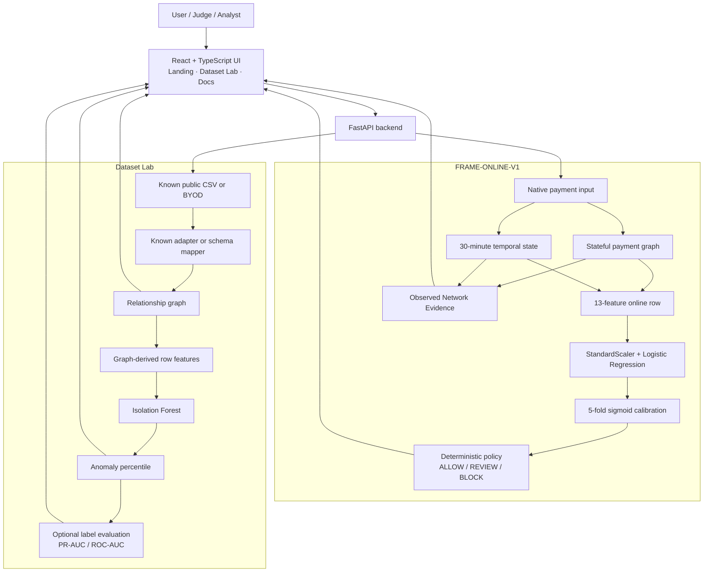
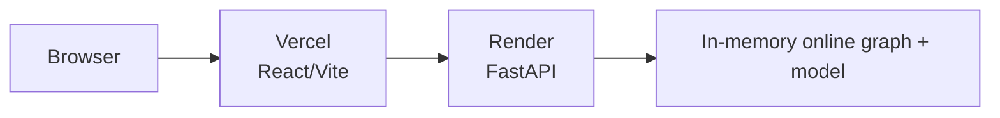

# FRAME Architecture

FRAME is an explainable fraud-analysis prototype built around two related but deliberately separate analysis modes:

1. `FRAME-ONLINE-V1` for native payment-risk scoring.
2. Dataset Lab for schema-adaptive relationship analysis.

They share the same product surface and graph-first thesis, but they do not pretend to be the same model.

---

## System overview



---

## 1. FRAME-ONLINE-V1

### Input contract

The online model expects FRAME's native payment schema:

```text
transaction_id
customer_id
merchant_id
device_id
card_id
ip_id
amount
timestamp
account_age_days
```

Training-only labels such as `is_fraud` and `fraud_ring_id` are intentionally excluded from the public scoring contract.

### Stateful context

The online engine maintains two kinds of state:

- a heterogeneous payment relationship graph
- rolling temporal activity for the previous 30 minutes

The graph uses these native entity types:

```text
customer
card
device
ip
merchant
```

The runtime currently lives in process memory. This keeps the prototype simple and deterministic but means a server restart resets online state.

### Online feature schema

The 13 production online features are:

```text
amount
account_age_days
customer_degree
card_degree
device_degree
merchant_degree
component_size
device_transactions_30m
ip_transactions_30m
customer_transactions_30m
device_customers_30m
ip_customers_30m
device_merchants_30m
```

Lifetime IP degree is intentionally not part of the production feature schema.

### Model

```text
StandardScaler
      ↓
LogisticRegression(
    max_iter=2000,
    class_weight="balanced",
    random_state=42,
)
      ↓
CalibratedClassifierCV(method="sigmoid", cv=5)
```

The resulting value is a calibrated risk probability for the native FRAME schema.

### Policy

The model does not independently authorize payments.

```text
risk < 0.020       → ALLOW
0.020 <= risk < .7 → REVIEW
risk >= 0.700      → BLOCK
```

The policy is deterministic and separate from model inference.

### Evidence layer

FRAME also computes observed graph/temporal facts such as shared devices, shared IPs, bursts, and multi-customer infrastructure.

This evidence is not a feature-attribution mechanism. It gives analysts concrete context around a decision without claiming that any one observation caused the model score.

---

## 2. Dataset Lab

Dataset Lab exists because arbitrary public fraud datasets do not share one universal schema.

It supports three execution paths.

### Built-in FRAME benchmark

The backend generates FRAME's own hard-negative relational benchmark, sorts events chronologically, and runs two layers:

```text
ordered benchmark transactions
        ├──→ Dataset Lab relationship analysis
        └──→ FRAME-ONLINE-V1 sequential scoring
```

This is why the built-in playback can display both:

- relationship anomaly analysis
- genuine `ALLOW / REVIEW / BLOCK` alerts

### Known adapter

Adapter-ready public datasets define known field mappings in the dataset catalog.

The browser verifies that required columns are present before `RUN FRAME` becomes available.

The adapter maps only fields that exist in the public schema.

### BYOD

Users upload an arbitrary CSV and map two or more observed entity columns, with optional mapping for:

- transaction ID
- timestamp
- amount
- label

FRAME does not synthesize missing device/IP/card/customer/merchant identifiers.

---

## Generic relationship graph

For each row, Dataset Lab constructs entity nodes from the selected mappings and adds pairwise relationships among the entities observed together in that row.

Graph edges accumulate:

- transaction count
- total observed amount

The generic graph is intentionally schema-adaptive rather than payment-schema-specific.

---

## Dataset Lab row features

The current generic relationship-anomaly model derives a compact row feature vector containing:

- `log1p(amount)`
- maximum participating entity degree
- mean participating entity degree
- maximum connected-component size among row entities
- maximum repeated pair transaction count
- number of participating entities

These feed an `IsolationForest`.

The raw Isolation Forest decision values are converted into within-run percentile ranks. Therefore:

> `99.2 percentile` means the row ranks as more anomalous than approximately 99.2% of rows in the analyzed run.

It does **not** mean a 99.2% probability of fraud.

If labels are mapped or supplied by a known adapter, FRAME computes PR-AUC and ROC-AUC against the anomaly ranking. Labels are not used as Isolation Forest inputs.

---

## Dataset compatibility tiers

FRAME's catalog uses explicit support tiers instead of implying every dataset is locally bundled or graph-native.

### Full pipeline

Native FRAME schema; complete graph + online-policy demonstration.

### Adapter ready

Known single-file schema that can be normalized through an existing FRAME adapter after the user supplies the official file.

### Multi-file graph

Relational dataset whose public release requires multiple coordinated files. The catalog documents the requirement rather than pretending one CSV is sufficient.

### Gated / multi-file

Dataset that also has access or redistribution constraints.

### Transaction only

Useful fraud benchmark but insufficient released relationship identifiers to validate FRAME's heterogeneous graph thesis.

---

## Playback semantics

Dataset results can include `stream_events` in original/chronological transaction order.

The browser progressively reveals entities and relationships from those events to make graph formation inspectable.

Important distinction:

- analysis is currently computed as a batch
- playback faithfully replays ordered rows in the browser
- FRAME does not claim this playback is a WebSocket/SSE production transport

A future production streaming design could publish post-score events to an analyst console using a dedicated event bus or SSE/WebSocket channel.

---

## API boundaries

### Online engine

```text
GET  /health
GET  /api/v1/stats
GET  /api/v1/graph
GET  /api/v1/risk/recent
GET  /api/v1/risk/{transaction_id}
POST /api/v1/risk/score
POST /api/v1/demo/reset
```

### Dataset Lab

```text
GET  /api/v1/datasets
POST /api/v1/analysis/dataset
POST /api/v1/analysis/builtin/frame-benchmark
```

---

## Deployment



Production surfaces:

- frontend: `https://frame-risk.vercel.app/`
- Dataset Lab: `https://frame-risk.vercel.app/demo/`
- branded docs: `https://frame-risk.vercel.app/docs/`
- API: `https://frame-api-tun8.onrender.com`

Render's public demo state is shared by the running process and is not a production multi-tenant storage design.

---

## Safety / correctness constraints

The online runtime currently enforces:

- duplicate transaction rejection
- monotonic timestamp ordering
- serialized scoring mutations
- thread-safe read snapshots
- label-free public scoring input
- bounded recent-result queries

Dataset Lab additionally enforces bounded public upload/row limits and bounded graph visualization.

---

## Evaluation boundaries

FRAME intentionally separates claims:

### Synthetic graph benchmark

Can support statements about planted fraud-ring behavior in the controlled synthetic environment.

It cannot support claims of real-world graph-ring performance.

### ULB Credit Card Fraud

Can support statements about transaction-level fraud discrimination on real anonymized labeled transactions.

It cannot validate customer/device/IP/card relationship behavior because those identifiers are not released in that dataset.

### Dataset Lab user uploads

Can support analysis of the relationships actually represented in the uploaded file.

FRAME never interprets absent relationship columns as observed evidence.

---

## Current architectural limitations

- in-memory online runtime state
- public demo is not tenant isolated
- generic Dataset Lab model is intentionally simple and unsupervised
- no GNN is used in the current scoring path
- no LLM independently scores, authorizes, reviews, or blocks transactions
- some dataset integrations remain documented compatibility profiles rather than bundled data
- multi-file/gated datasets need dedicated ingestion workflows beyond the public single-CSV demo

These constraints are deliberate and documented rather than hidden behind broader claims.
